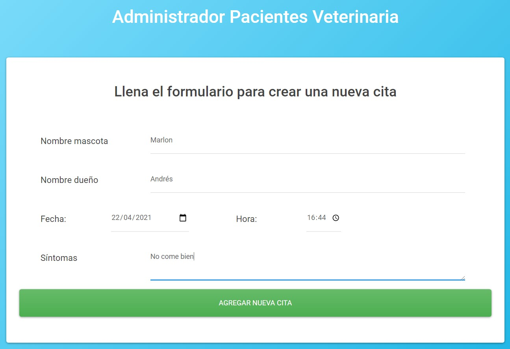
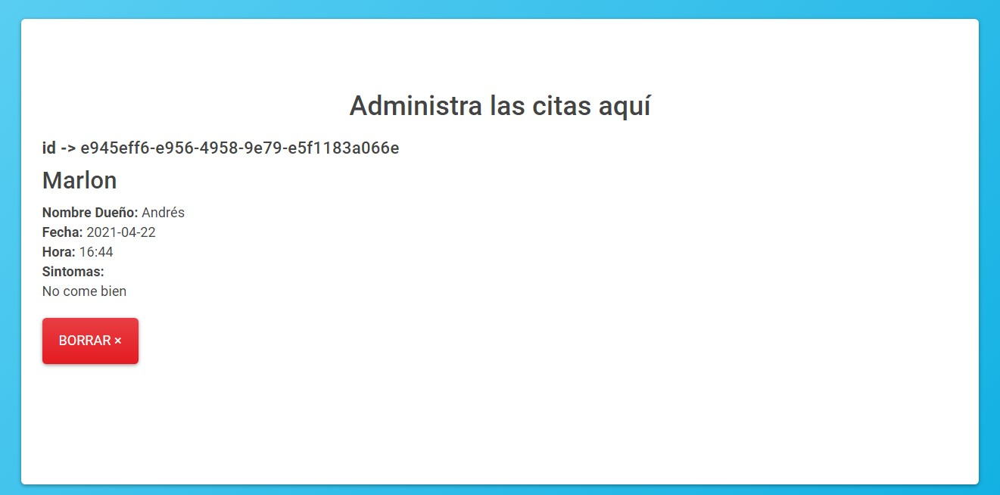

### Web app administrador pacientes veterinaria 🐶
#### Tecnologías: 📌
React + state + proptypes

#### - Instalar dependencias :hammer:
```
yarn install
```


#### - Arranque :key:
```
yarn start
```
Url de acceso: [http://localhost:3000](http://localhost:3000)

#### - Capturas del proyecto :camera:
####
- Formulario de citas

####
- Listado de citas y borrado

####
